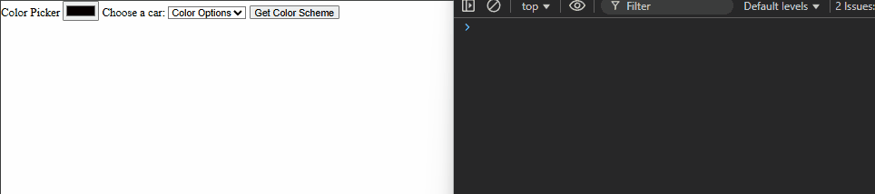

# 🎨 Color Scheme Generator

This is a simple web application that allows users to generate color schemes based on a seed color using [The Color API](https://www.thecolorapi.com/). Users can choose a color, select a scheme mode, and view the resulting palette with corresponding hex codes.

## 🚀 Features

- Select a **seed color** using a color picker
- Choose a **color scheme mode** (e.g., monochrome, analogic)
- Request and display color schemes using The Color API
- Display the color swatches and their hex values
- (Stretch goal) Click a hex value to copy it to the clipboard

## 🛠️ Technologies Used

- HTML
- CSS
- JavaScript
- The Color API

## 🖼️ Preview


## 🔧 How to Run

1. Clone this repository:
```bash
   git clone https://github.com/yourusername/color-scheme-generator.git
   cd color-scheme-generator
````

2. Open `index.html` in your browser.

## ✨ Stretch Goals

* [ ] Click to copy hex codes to clipboard
* [ ] Add animation when a new scheme is loaded


---

## ✅ Development Checklist


| Feature                                                                 | Status     |
|------------------------------------------------------------------------|------------|
| Input field to select seed color (`<input type="color" />`)           | ☐ Not done |
| `<select>` box for choosing color scheme mode                         | ☐ Not done |
| Button to trigger fetch request to The Color API                      | ☐ Not done |
| Display of color swatches from API response                           | ☐ Not done |
| Display hex values for each color swatch                              | ☐ Not done |
| Click hex value to copy to clipboard (stretch goal)                   | ☐ Not done |
| Responsive design for mobile layout                                   | ☐ Not done |
| Error handling for failed API requests                                | ☐ Not done |


```js
colorPick.addEventListener('change', () => {})
```

Originally i had an event listener on `input`. The issue with this was each color selected would trigger an API call. In a production scenario, third party or open source rate limitation would be invoked or alternitvely a drain of resources and API calls.




```js
colorPick.addEventListener('input', () => {})
```


